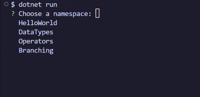

<div align="center">
   <br>
  <a href="/">EN</a> | ID <br>
  <p>My journey to learn C# fundamentals in school</p>
</div>

## Pengenalan
Hai! Namaku **Arya**, aku adalah siswa kelas 10 dari SMK di Indonesia. Di sini aku mengambil kejuruan yaitu **Pengembangan Perangkat Lunak dan GIM (PPLG)**. Karena fokusnya ke game devnya, jadi di sini kami diajari tentang bahasa pemrograman C#.

Repository ini berisi seluruh kode praktik, contoh, tugas, dan juga latihan yang diberi oleh guruku di sekolah.  
Jangan ragu untuk mengeksplor kode-kodeku dan siapa tahu dapat membantumu belajar juga.

## Stuktur Repository
```
CSharpJourney
├ Experiments        # Hasil nyoba-nyoba sendiri (bukan dari sekolah)
├ Journey            # Folder utama berisi proyek
│ ╰ [Chapter]        # Namespace atau bab pembelajaran
|   ├ Assigment.cs   # Kode tugas dari guru
|   ├ Example.cs     # Contoh kode dari guru
|   ├ Exercise.cs    # Kode dari guru untuk latihan
|   ╰ Practise.cs    # Kode praktik untuk memahami materi yang diberikan guru
╰ Program.cs         # Main code program to execute first
```

## Persyaratan (Requirements)
Pastikan kamu sudah menginstall:
- .NET SDK 8+
- Visual Studio atau VS Code
- Git (Optional)

## Cara Menjalankan
1. Salin repository-nya  
   ```sh
   git clone https://github.com/aryareal1/CSharpJourney
   ```
2. Jalankan perintah  
   ```sh
   dotnet run 
   ```
3. Pilih proyek yang mau dijalankan  
   