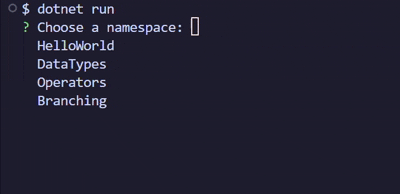

<div align="center">
   <br>
  EN | <a href=".github/README-ID.md">ID</a> <br>
  <p>My journey to learn C# fundamentals in school</p>
</div>

## Introduction
Hi! My name is **Arya**, and I'm a 10th-grade student at a vocational high school in Indonesia. I'm majoring in **Software Development and Game Development (PPLG)**. Because the focus is on game development, we're taught the C# programming language.

This repository contains all the practice code, examples, assignments, and exercises given by the teachers at school.  
Feel free to explore my code and perhaps you'll enjoy learning too.

> [!NOTE]
> Comments and texts in the codes may be in Indonesian.

## Repository Structure
```
CSharpJourney
├ Experiments        # Things I made myself not from school
├ Journey            # Main folder of projects
│ ╰ [Chapter]        # Namespace or chapters
|   ├ Assigment.cs   # Code created according to instructions given by the teacher as an assignment
|   ├ Example.cs     # Example codes given by the teacher
|   ├ Exercise.cs    # Code created according to instructions given by the teacher as an exercise
|   ╰ Practise.cs    # Codes given by the teacher for practice and understanding
╰ Program.cs         # Main code program to execute first
```

## Requirements
Make sure you installed:
- .NET SDK 8+
- Visual Studio or VS Code
- Git (Optional)

## How to Execute
1. Copy the repository
   ```sh
   git clone https://github.com/aryareal1/CSharpJourney
   ```
2. Run the command
   ```sh
   dotnet run 
   ```
3. Choose which project to run
   
